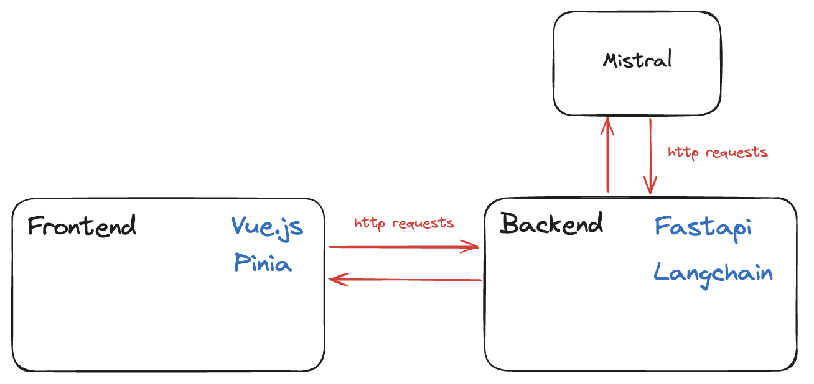
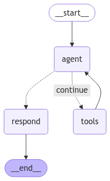

# Mistral QB Hackathon

This project was built during the 2-day Mistral-Quantum Black Hackathon at École Polytechnique in Paris, by Diane Mansard, Felix Müller, [Luis Wiedmann](https://www.linkedin.com/in/luis-wiedmann/) and [Jan Dorn](https://www.linkedin.com/in/jandorn/).

## Overview

The goal of the hackathon was to build a retail assistant using LLMs provided by Mistral. It was not specified what kind of product to sell, so early on we decided to build a travel planner that helps users find the perfect trip and then sells it to them.

Through a user-friendly webapp, the user can input their preferences using some default filters and a free-text field or ask for suggestions. The webapp then uses the LLM to find the perfect trip and displays it to the user. The user can iterate on the the results by chatting with the LLMs and adjusting the filters. As soon as the user is happy with the results, he or she can buy the trip by following a link to the appropriate booking page.

## Installation
To lauch the app locally, we have to spin up a local webserver for the webapp and the backend.

### Webapp
From the `webapp` directory, run 

```
npm install
npm run dev
```

This will launch the webapp on `localhost:5173`.

### Backend
From the `backend` directory, run (if desired in a virtual environment)

```
pip install -r requirements.txt
fastapi dev
```

The backend needs some API keys to be set in the environment variables to work. Create a `.env` file in the root directory and prepare your keys for the following services:

- TAVILY_API_KEY="..."
    - see https://www.tavily.com/
- MISTRAL_API_KEY="..."
    - see https://mistral.ai/
- UNSPLASH_ACCESS_KEY="..."
    - see https://unsplash.com/developers
- OPENWEATHERMAP_API_KEY="..."
    - see https://openweathermap.org/

## Project Architecture

The following diagram shows the architecture of the project.



The project consists of a frontend that is rendered in the browser and a backend that is handling the HTTP post requests coming from the webapp.
The backend is then forwarding a prompt to the Mistral API. Using the Mistral Large Model, we get back a structured response (JSON) that is then parsed in the frontend and displayed to the user.

## Webapp

The frontend is built using the reactive frontend framework [Vue.js](https://vuejs.org/) and [Pinia](https://pinia.vuejs.org/) for state management.

## Backend

The logic of the backend is implemented as an ReAct AI Agent through LangGraph. The agent is implemented as a "state machine" which is in the form of a "StateGraph" that implements the Mistral API and gives it multiple toold to fullfill the user query.

Additional Tools for the agent:
- web search
- weather forecast
- datetime
- image api

With these tools the agent can autonomously fullfill the user query, regardless of how complex or specific it is. The ability to query the web to find the best way to fullfill the given query coupled with the graphs state memory enable the agent to fullfill complex, specific and personalised user queries.


